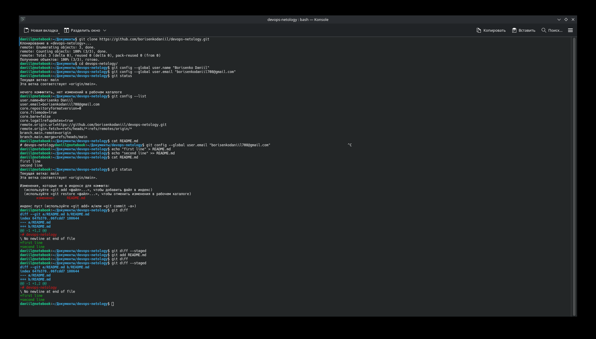
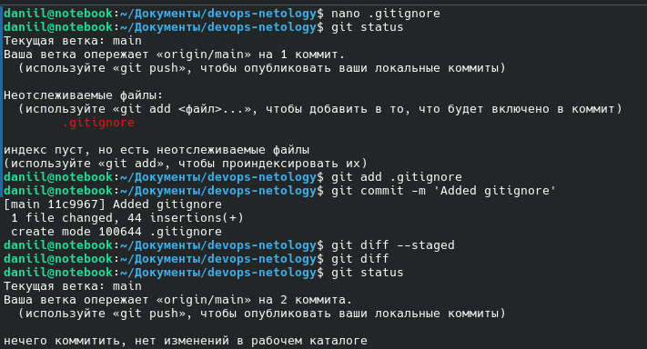

# Домашнее задание к занятию "13.01 Системы контроля версий" - "Борисенко Даниил"

## Задание 1. Создать и настроить репозиторий для дальнейшей работы на курсе

### Создание репозитория и первого коммита

Для выполнения домашнего задания создал отдельный публичный репозиторий:


При создании репозитория добавил файл `README.md`.

Для авторизации в GitHub по HTTPS создал Personal Access Token.

Репозиторий клонировал на локальный компьютер:

```bash
git clone https://github.com/borisenkodaniil/devops-netology.git
cd devops-netology
```

Настроил имя пользователя и email для Git:

```bash
git config --global user.name "Borisenko Daniil"
git config --global user.email "borisenkodaniil1708@gmail.com"
```

Проверил состояние репозитория:

```bash
git status
```

Изменил файл `README.md` и проверил его состояние:

```bash
git status
```

Для просмотра изменений использовал команды:

```bash
git diff
git diff --staged
```

Добавил изменённый `README.md` в индекс:

```bash
git add README.md
```

После добавления файла ещё раз проверил изменения:

```bash
git diff
git diff --staged
```

Создал первый коммит:

```bash
git commit -m "First commit"
```



## Создание `.gitignore`

Создал файл `.gitignore` с правилами для Terraform.

```bash
nano .gitignore
git status
git add .gitignore
```

В `.gitignore` добавлены правила, благодаря которым Git будет игнорировать:

- `.terraform/` - игнорируется весь каталог `.terraform` со всем содержимым.
- `*.tfstate` - игнорируются все файлы, заканчивающиеся на `.tfstate`.
- `*.tfstate.*` - игнорируются все файлы, содержащие `.tfstate.` в имени.
- `crash.log`,`override.tf`,`override.tf.json` - игнорируются файлы с точными именами `crash.log`,`override.tf`,`override.tf.json`
- `crash.*.log` - все файлы вида `crash.*.log`.
- `*.tfvars` - все файлы с расширением `.tfvars`.
- `*.tfvars.json` - все файлы, заканчивающиеся на `.tfvars.json`.
- `*_override.tf`, `*_override.tf.json` - файлы, заканчивающиеся на `override.tf` либо `override.tf.json`.
- `.terraform.tfstate.lock.info` - игнорирует все файлы с таким точным именем.
- `.terraformrc`, `terraform.rc` - игнорирует файлы с такими точными именами.

Обозначения:

- `/` - указывает на директорию.
- `*` - указывает на любое количество символов.

После добавления `.gitignore` создал коммит:

```bash
git commit -m "Added gitignore"
```



## Удаление и перемещение файлов

Создал два тестовых файла:

```bash
echo "will_be_deleted" >> will_be_deleted.txt
echo "will_be_moved" >> will_be_moved.txt
```

Добавил файлы в индекс:

```bash
git add will_be_*
```

Создал коммит:

```bash
git commit -m "Prepare to delete and move"
```

После этого удалил файл `will_be_deleted.txt`:

```bash
rm will_be_deleted.txt
```

Файл `will_be_moved.txt` переименовал в `has_been_moved.txt`:

```bash
mv will_be_moved.txt has_been_moved.txt
```

Проверил результат:

```bash
git status
```

Добавил изменения в индекс и зафиксировал их:

```bash
git add has_been_moved.txt
git add will_be_*
git commit -m "Moved and deleted"
```

В результате файл `will_be_deleted.txt` был удалён из репозитория, а файл `will_be_moved.txt` был переименован в `has_been_moved.txt`.


## Проверка истории коммитов

Историю изменений проверил командой:

```bash
git log
```

В истории репозитория присутствуют основные коммиты:

- `Initial commit`
- `First commit`
- `Added gitignore`
- `Prepare to delete and move`
- `Moved and deleted`

## Отправка изменений в удалённый репозиторий

Изменения отправил на GitHub командой:

```bash
git push
```


---
