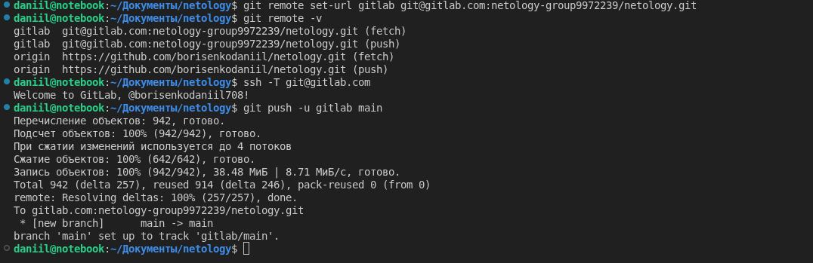
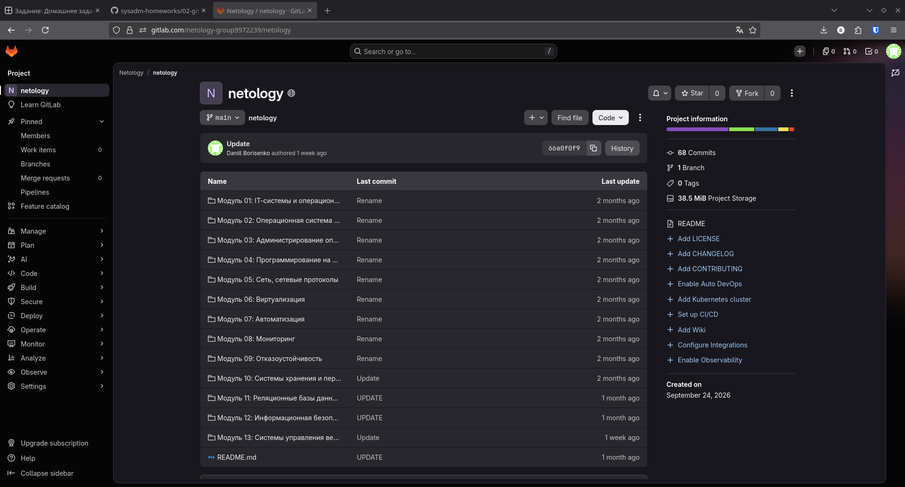
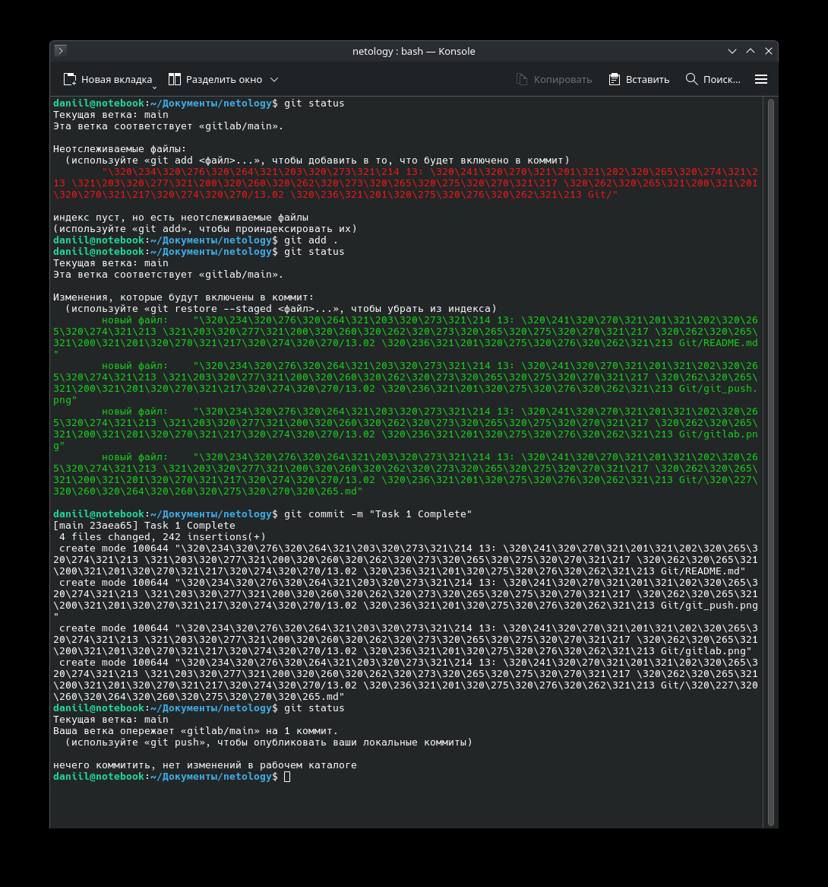
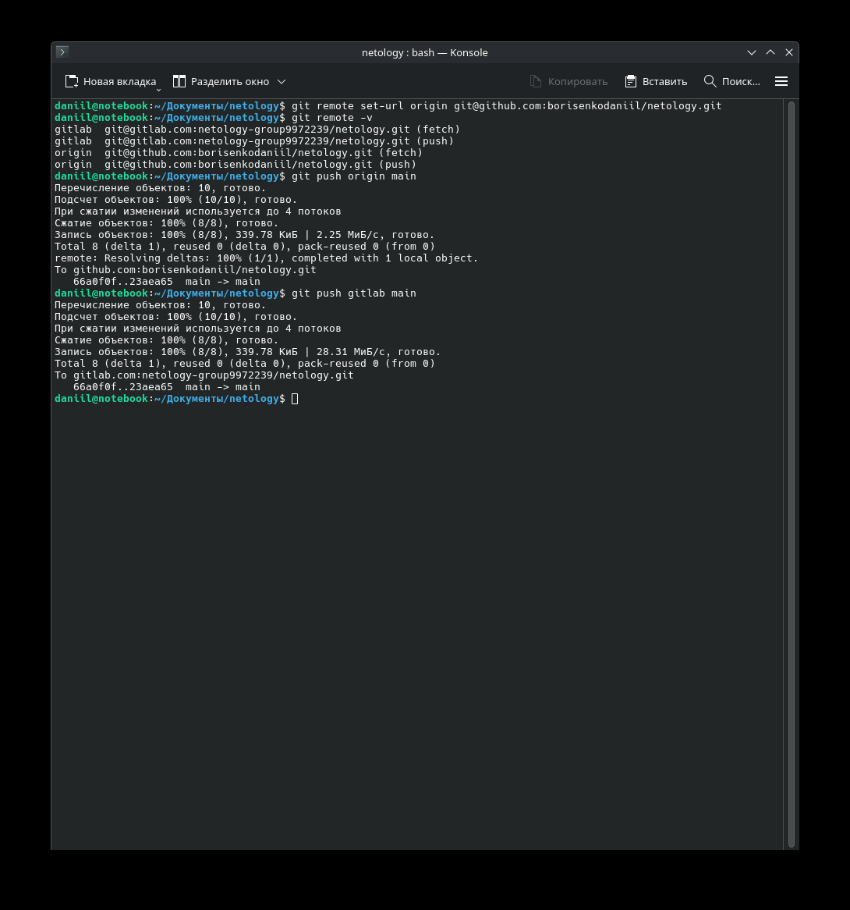
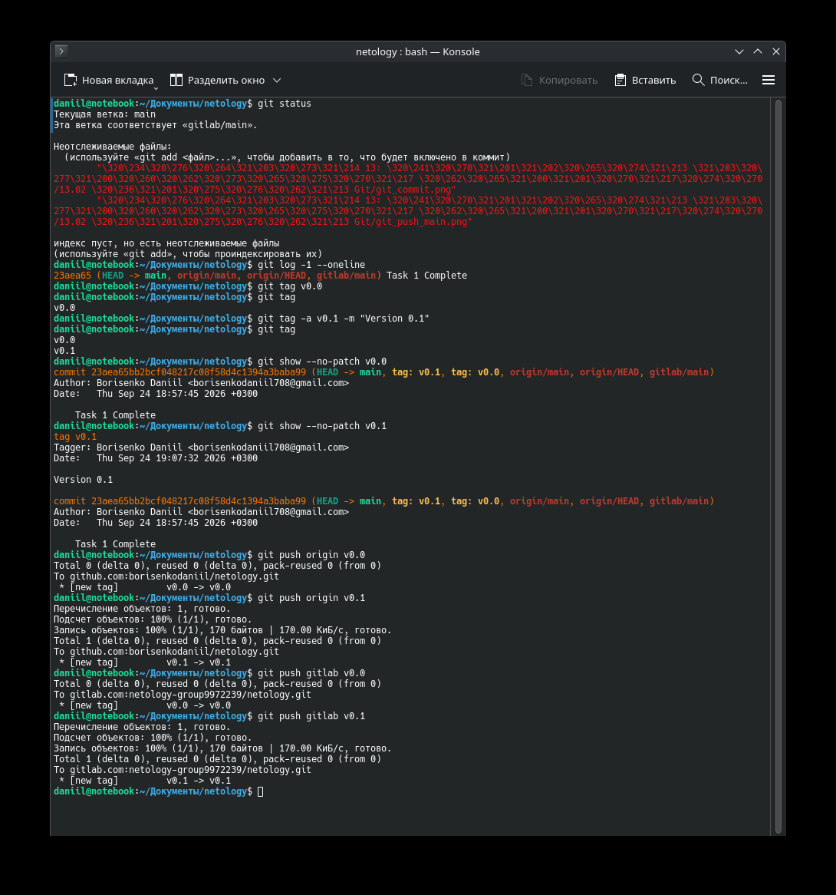
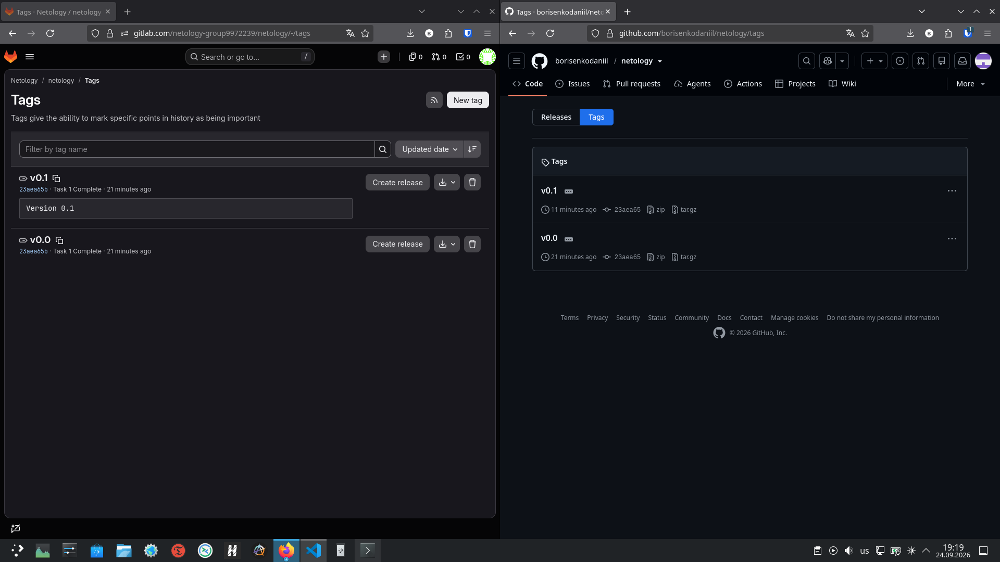

# Домашнее задание к занятию "13.02 Основы Git" - "Борисенко Даниил"

---

## Задание 1. Знакомимся с GitLab

Для выполнения задания был создан дополнительный удалённый репозиторий в GitLab.

### Репозитории

GitHub: https://github.com/borisenkodaniil/netology

GitLab: https://gitlab.com/netology-group9972239/netology

### Создание репозитория в GitLab

1. В GitLab был создан новый публичный репозиторий `netology`.

2. Для работы с GitLab было настроено подключение по SSH.

GitLab был добавлен как дополнительный удалённый репозиторий.

Проверка настроенных удалённых репозиториев:

```bash
git remote -v
```

Результат:

```text
gitlab  git@gitlab.com:netology-group9972239/netology.git (fetch)
gitlab  git@gitlab.com:netology-group9972239/netology.git (push)
origin  https://github.com/borisenkodaniil/netology.git (fetch)
origin  https://github.com/borisenkodaniil/netology.git (push)
```

Таким образом, локальный репозиторий связан с двумя удалёнными репозиториями:

- `origin` — GitHub;
- `gitlab` — GitLab.

3. Для отправки существующей ветки `main` в GitLab была выполнена команда:

```bash
git push -u gitlab main
```



После выполнения команды ветка `main` и история коммитов существующего репозитория появились в GitLab.



---

## Задание 2. Теги

1. Перед созданием тегов были зафиксированы изменения, выполненные в задании 1.

Файлы были добавлены в индекс:

```bash
git add .
```

Изменения были сохранены в истории Git отдельным коммитом:

```bash
git commit -m "Task 1 Complete"
```

После создания коммита была выполнена повторная проверка:

```bash
git status
```



Перед созданием тегов новый коммит был отправлен в оба удалённых репозитория.

В GitHub:

```bash
git push origin main
```

В GitLab:

```bash
git push gitlab main
```

После выполнения команд ветка `main` в GitHub и GitLab содержала одинаковое состояние.



3. Для текущего коммита был создан легковесный тег:

```bash
git tag v0.0
```

Тег является указателем на определённый коммит.

4. Затем был создан аннотированный тег `v0.1`:

```bash
git tag -a v0.1 -m "Version 0.1"
```

Аннотированный тег, в отличие от легковесного, хранит дополнительную информацию: автора, дату создания и комментарий.

Проверка созданных тегов:

```bash
git tag
```

Результат:

```text
v0.0
v0.1
```

5. Для просмотра информации о легковесном теге была выполнена команда:

```bash
git show --no-patch v0.0
```

В выводе отображается информация непосредственно о коммите.

Для просмотра аннотированного тега:

```bash
git show --no-patch v0.1
```

В этом случае дополнительно отображается информация о самом теге:

```text
tag v0.1
Tagger: Borisenko Daniil
Version 0.1
```

Таким образом:

- `v0.0` — легковесный тег, который является указателем на коммит;
- `v0.1` — аннотированный тег, содержащий дополнительные метаданные.

6. Легковесный тег был отправлен в GitHub и GitLab:

```bash
git push origin v0.0
git push gitlab v0.0
```

Аннотированный тег так же был отправлен в GitHub и GitLab:

```bash
git push origin v0.1
git push gitlab v0.1
```

После выполнения команд теги `v0.0` и `v0.1` появились в обоих удалённых репозиториях.



7. После отправки тегов была открыта страница тегов GitHub и GitLab.

На странице отображаются созданные теги `v0.0` и `v0.1`.



---
