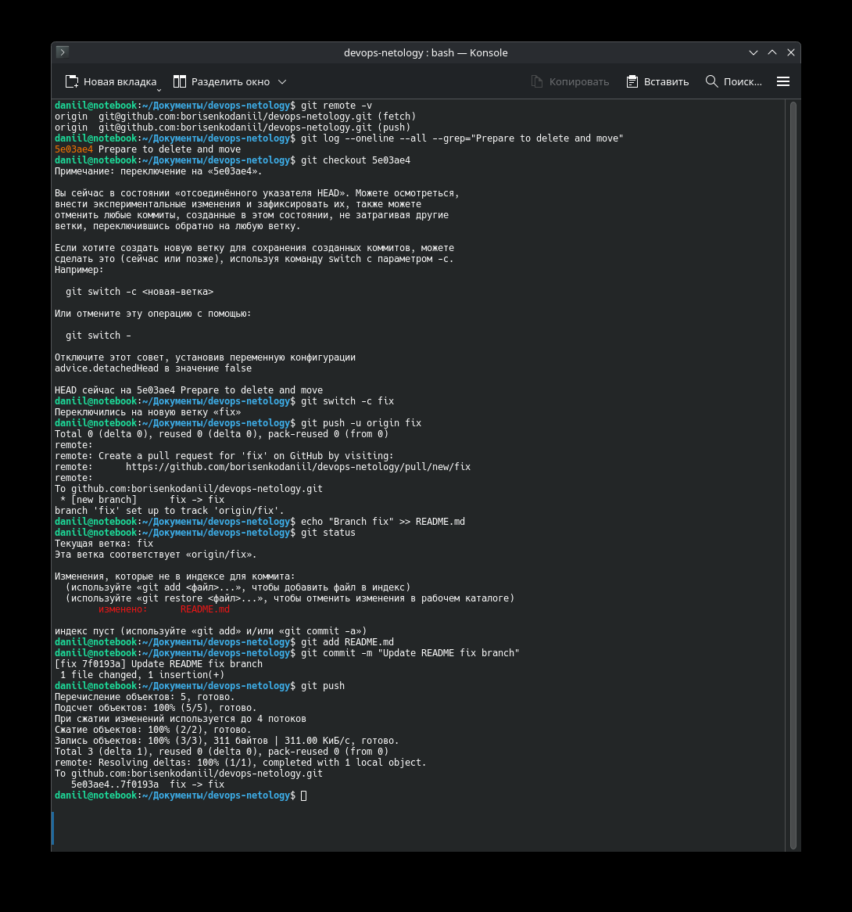
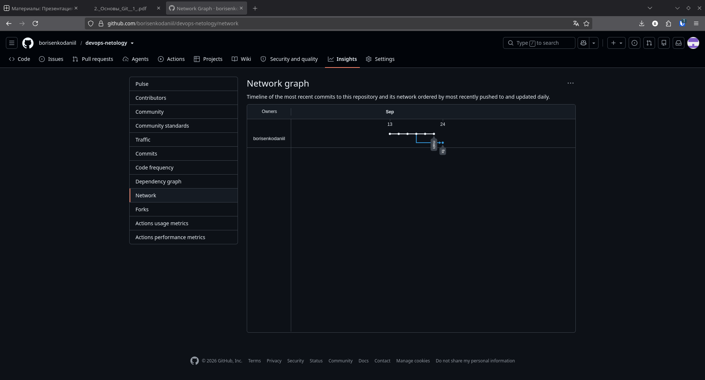
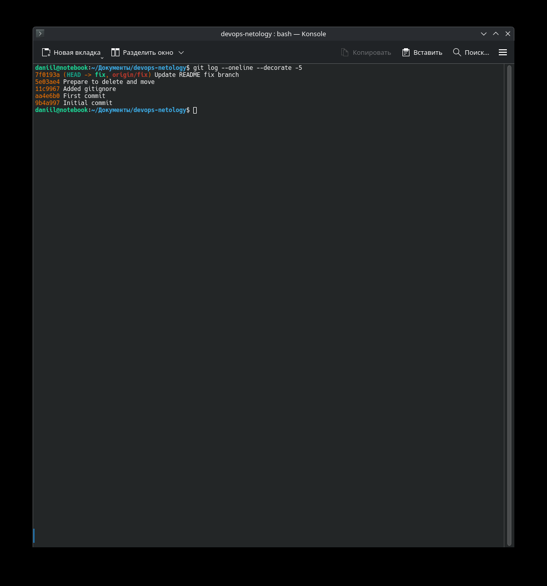
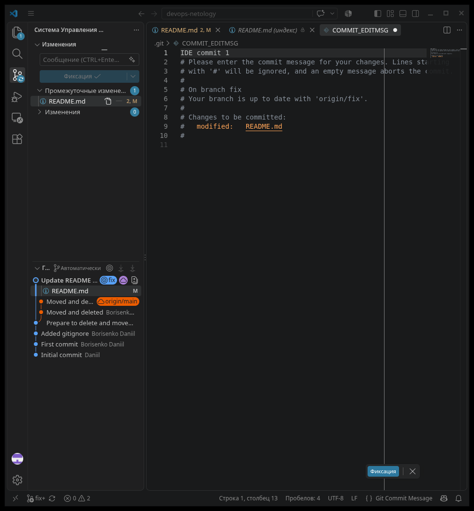
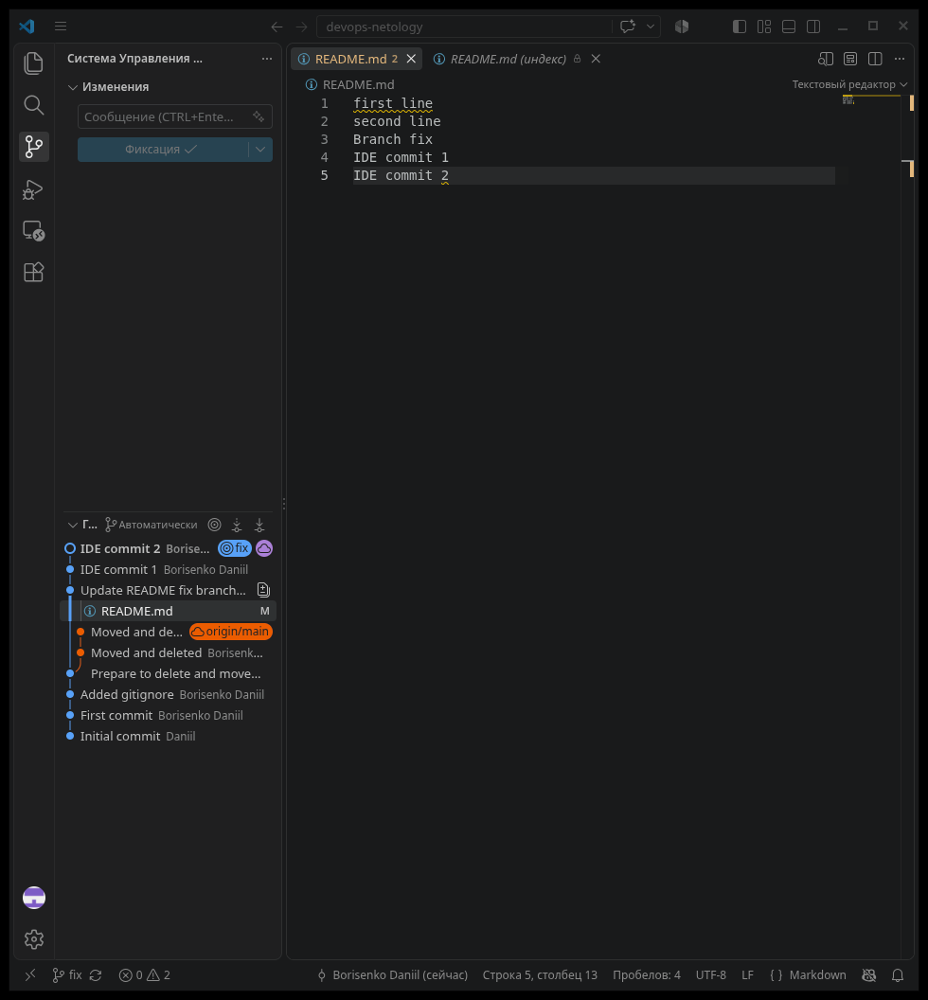

# Домашнее задание к занятию "13.02 Основы Git" - "Борисенко Даниил"

---

## Задание 1. Знакомимся с GitLab

Для выполнения задания был создан дополнительный удалённый репозиторий в GitLab.

### Репозитории

GitHub: https://github.com/borisenkodaniil/netology

GitLab: https://gitlab.com/netology-group9972239/netology

### Создание репозитория в GitLab

1. В GitLab был создан новый публичный репозиторий `netology`.

2. Для работы с GitLab было настроено подключение по SSH.

GitLab был добавлен как дополнительный удалённый репозиторий.

Проверка настроенных удалённых репозиториев:

```bash
git remote -v
```

Результат:

```text
gitlab  git@gitlab.com:netology-group9972239/netology.git (fetch)
gitlab  git@gitlab.com:netology-group9972239/netology.git (push)
origin  https://github.com/borisenkodaniil/netology.git (fetch)
origin  https://github.com/borisenkodaniil/netology.git (push)
```

Таким образом, локальный репозиторий связан с двумя удалёнными репозиториями:

- `origin` — GitHub;
- `gitlab` — GitLab.

3. Для отправки существующей ветки `main` в GitLab была выполнена команда:

```bash
git push -u gitlab main
```


После выполнения команды ветка `main` и история коммитов существующего репозитория появились в GitLab.


---

## Задание 2. Теги

1. Перед созданием тегов были зафиксированы изменения, выполненные в задании 1.

Файлы были добавлены в индекс:

```bash
git add .
```

Изменения были сохранены в истории Git отдельным коммитом:

```bash
git commit -m "Task 1 Complete"
```

После создания коммита была выполнена повторная проверка:

```bash
git status
```


Перед созданием тегов новый коммит был отправлен в оба удалённых репозитория.

В GitHub:

```bash
git push origin main
```

В GitLab:

```bash
git push gitlab main
```

После выполнения команд ветка `main` в GitHub и GitLab содержала одинаковое состояние.


3. Для текущего коммита был создан легковесный тег:

```bash
git tag v0.0
```

Тег является указателем на определённый коммит.

4. Затем был создан аннотированный тег `v0.1`:

```bash
git tag -a v0.1 -m "Version 0.1"
```

Аннотированный тег, в отличие от легковесного, хранит дополнительную информацию: автора, дату создания и комментарий.

Проверка созданных тегов:

```bash
git tag
```

Результат:

```text
v0.0
v0.1
```

5. Для просмотра информации о легковесном теге была выполнена команда:

```bash
git show --no-patch v0.0
```

В выводе отображается информация непосредственно о коммите.

Для просмотра аннотированного тега:

```bash
git show --no-patch v0.1
```

В этом случае дополнительно отображается информация о самом теге:

```text
tag v0.1
Tagger: Borisenko Daniil
Version 0.1
```

Таким образом:

- `v0.0` — легковесный тег, который является указателем на коммит;
- `v0.1` — аннотированный тег, содержащий дополнительные метаданные.

6. Легковесный тег был отправлен в GitHub и GitLab:

```bash
git push origin v0.0
git push gitlab v0.0
```

Аннотированный тег так же был отправлен в GitHub и GitLab:

```bash
git push origin v0.1
git push gitlab v0.1
```

После выполнения команд теги `v0.0` и `v0.1` появились в обоих удалённых репозиториях.


7. После отправки тегов была открыта страница тегов GitHub и GitLab.

На странице отображаются созданные теги `v0.0` и `v0.1`.


---

## Задание 3. Ветки

1. Для выполнения задания использовался репозиторий предыдущего домашнего задания:

https://github.com/borisenkodaniil/devops-netology

Сначала был найден коммит с сообщением `Prepare to delete and move`:

```bash
git log --oneline --all --grep="Prepare to delete and move"
```

После этого был выполнен переход на найденный коммит:

```bash
git checkout 5e03ae4
```

На основе этого коммита была создана новая ветка `fix`:

```bash
git switch -c fix
```

Созданная ветка была отправлена в GitHub:

```bash
git push -u origin fix
```

После отправки локальная ветка `fix` стала отслеживать удалённую ветку `origin/fix`.

2. В файл `README.md` была добавлена новая строка:

```bash
echo "Branch fix" >> README.md
```

Состояние рабочей директории было проверено командой:

```bash
git status
```

После этого изменённый файл был добавлен в индекс:

```bash
git add README.md
```

И создан новый коммит:

```bash
git commit -m "Update README fix branch"
```

Изменения были отправлены в удалённую ветку `fix`:

```bash
git push
```



3. После создания отдельного коммита в ветке `fix` был открыт раздел `Insights -> Network` репозитория GitHub.

На графе видно, что ветка `fix` ответвилась от более старого состояния основной истории и получила собственный коммит.



4. Для проверки истории ветки была выполнена команда:

```bash
git log --oneline --decorate -5
```

Результат:

```text
7f0193a (HEAD -> fix, origin/fix) Update README fix branch
5e03ae4 Prepare to delete and move
11c9967 Added gitignore
aa4e6b0 First commit
9b4a997 Initial commit
```

Из вывода видно, что:

- текущий `HEAD` находится на ветке `fix`;
- ветка `fix` синхронизирована с `origin/fix`;
- новый коммит `Update README fix branch` создан после коммита `Prepare to delete and move`.



---

## Задание 4. Упрощаем себе жизнь

Для выполнения задания использовался визуальный интерфейс работы с Git в Visual Studio Code.

Вместо команд Git в терминале изменения индексировались и фиксировались через графический интерфейс IDE.

1. В файл `README.md` была добавлена строка:

```text
IDE commit 1
```

2. Файл `README.md` был добавлен в подготовленные изменения, после чего через интерфейс Visual Studio Code был создан коммит с сообщением:

```text
IDE commit 1
```



3. После первого коммита файл `README.md` был изменён ещё раз. В него была добавлена строка:

```text
IDE commit 2
```

Для второго коммита было указано сообщение:

```text
IDE commit 2
```

В графе истории Git отображаются оба созданных через Visual Studio Code коммита:

```text
IDE commit 2
IDE commit 1
```

Также на графе видно, что работа выполнялась в ветке `fix`.



4. В результате задания были выполнены два последовательных коммита с использованием графического интерфейса Git в Visual Studio Code:

- `IDE commit 1`;
- `IDE commit 2`.

---
