# Домашнее задание к занятию "13.03 Ветвления в Git" - "Борисенко Даниил"

---

## Задание «Ветвление, merge и rebase»

### Репозиторий

GitHub:

https://github.com/borisenkodaniil/devops-netology

Network Graph:

https://github.com/borisenkodaniil/devops-netology/network

---

## 1. Подготовка

Для выполнения задания в репозитории был создан каталог `branching`:

```bash
mkdir branching
```

В каталоге были созданы два файла:

```text
branching/merge.sh
branching/rebase.sh
```

Изначально оба файла содержали код:

```bash
#!/bin/bash
# display command line options

count=1
for param in "$*"; do
    echo "\$* Parameter #$count = $param"
    count=$(( $count + 1 ))
done
```

Файлы добавлены в индекс:

```bash
git add branching/
```

После этого был создан коммит:

```bash
git commit -m "prepare for merge and rebase"
```

Коммит был отправлен в ветку `main`:

```bash
git push -u origin main
```

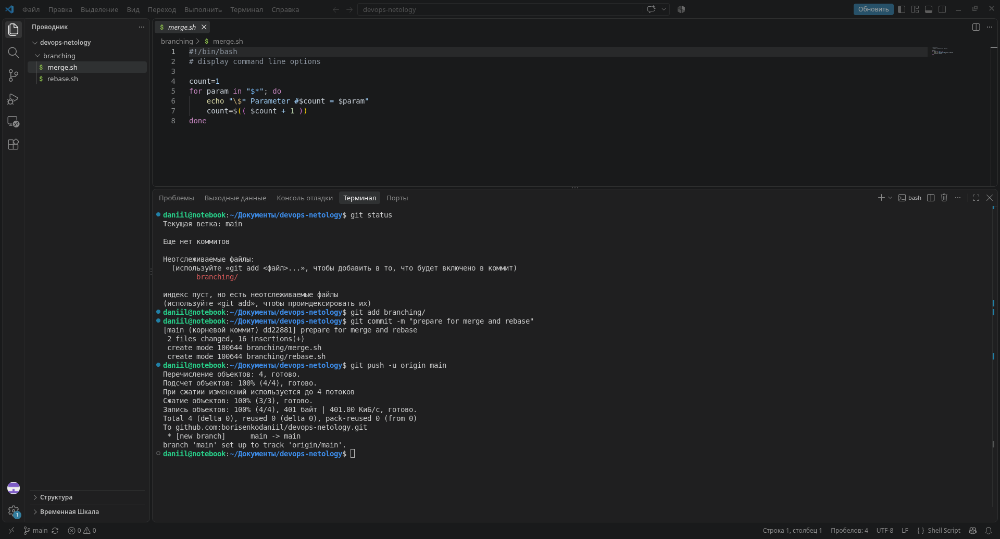

---

## 2. Подготовка git-merge

### Создание ветки

Была создана отдельная ветка `git-merge`:

```bash
git switch -c git-merge
```

### Первое изменение merge.sh

В файле `branching/merge.sh` переменная `$*` была заменена на `$@`.

Изменения были проверены командой:

```bash
git diff
```

После этого был создан коммит:

```bash
git commit -m "merge: @ instead *"
```

Ветка была отправлена в GitHub:

```bash
git push -u origin git-merge
```

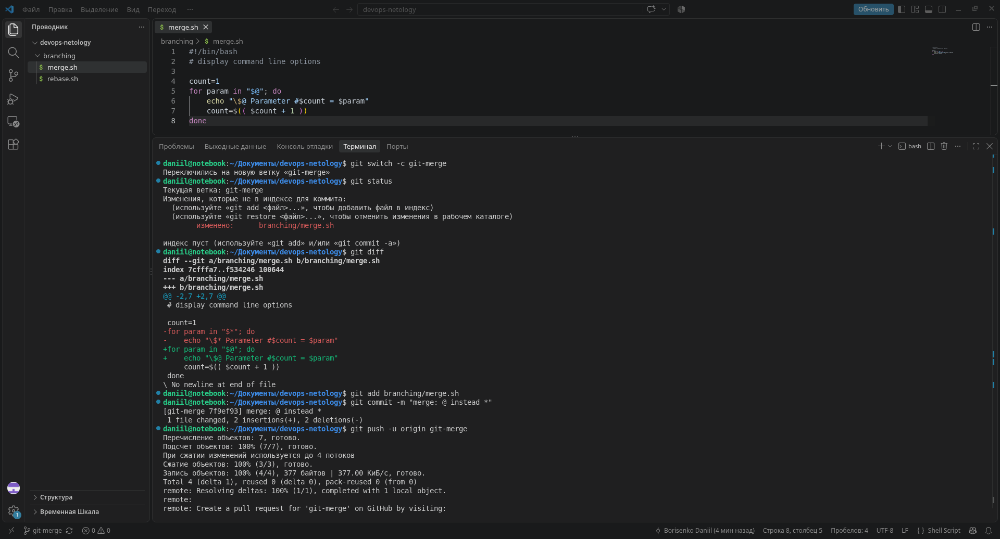

### Изменение merge.sh

После этого файл `merge.sh` был изменён ещё раз.

```bash
#!/bin/bash
# display command line options

count=1
while [[ -n "$1" ]]; do
    echo "Parameter #$count = $1"
    count=$(( $count + 1 ))
    shift
done
```

Был создан второй коммит:

```bash
git commit -m "merge: use shift"
```

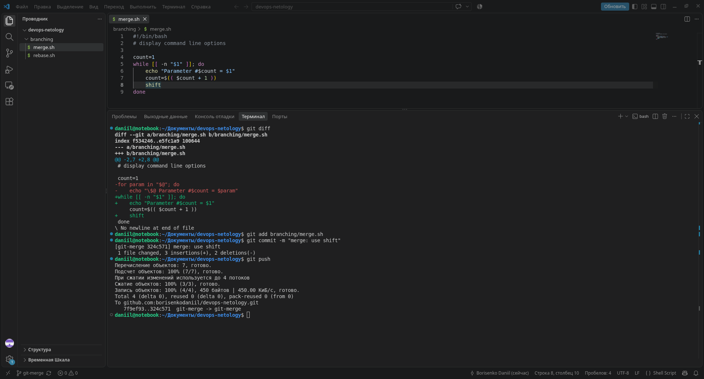

---

## 3. Изменение ветки main

После завершения работы в `git-merge` был выполнен возврат в основную ветку:

```bash
git switch main
```

Состояние репозитория было проверено:

```bash
git status
```

В ветке `main` был изменён файл `rebase.sh`.

```bash
#!/bin/bash
# display command line options

count=1
for param in "$@"; do
    echo "\$@ Parameter #$count = $param"
    count=$(( $count + 1 ))
done

echo "====="
```

После этого создан коммит:

```bash
git commit -m "rebase: @ instead *"
```

Изменения были отправлены в `main`:

```bash
git push
```

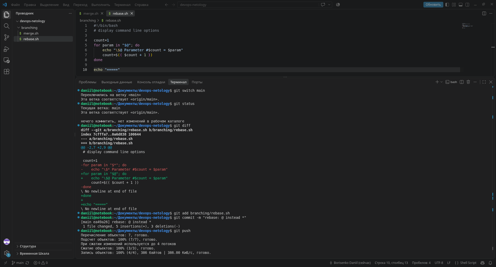

---

## 4. Подготовка ветки git-rebase

### Поиск коммита

По условию новая ветка должна была быть от коммита, в котором были впервые добавлены файлы `merge.sh` и `rebase.sh`.

Для поиска этого коммита использовалась команда:

```bash
git log --oneline --all --grep="prepare for merge and rebase"
```

После этого был выполнен переход на него:

```bash
git checkout dd22881
```

На основе найденного коммита создана новая ветка:

```bash
git switch -c git-rebase
```

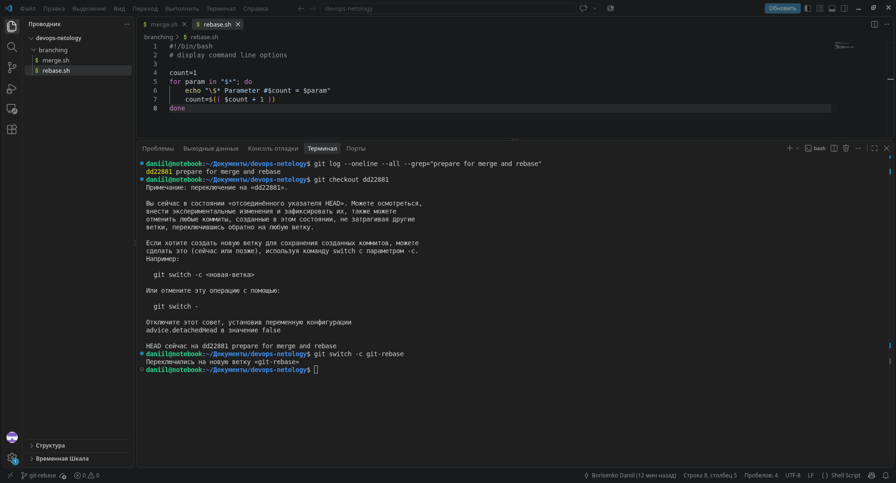

### Первый коммит git-rebase

Файл `rebase.sh` был изменён следующим образом:

```bash
#!/bin/bash
# display command line options

count=1
for param in "$@"; do
    echo "Parameter: $param"
    count=$(( $count + 1 ))
done

echo "====="
```

После этого создан коммит:

```bash
git commit -m "git-rebase 1"
```

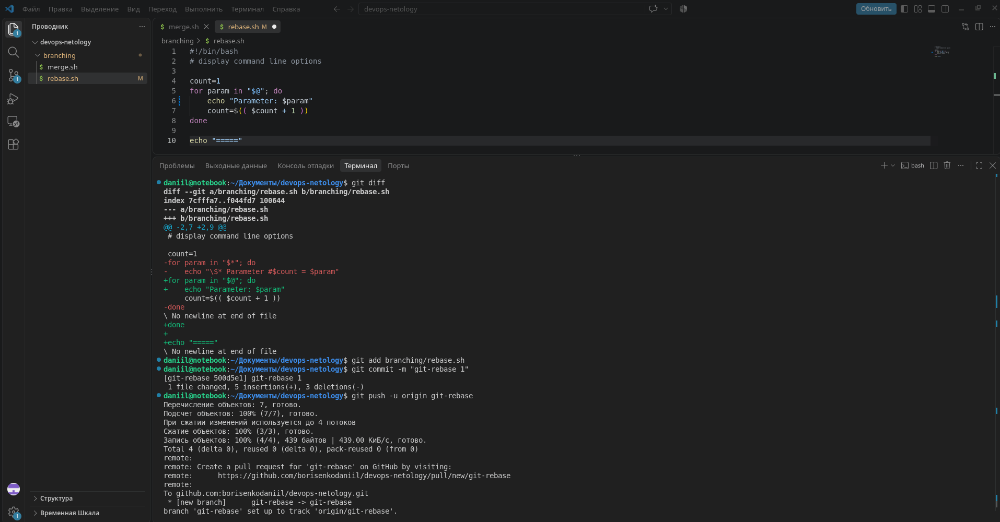

### Второй коммит git-rebase

В файле была изменена строка:

```bash
echo "Parameter: $param"
```

на:

```bash
echo "Next parameter: $param"
```

После проверки изменений был создан второй коммит:

```bash
git commit -m "git-rebase 2"
```

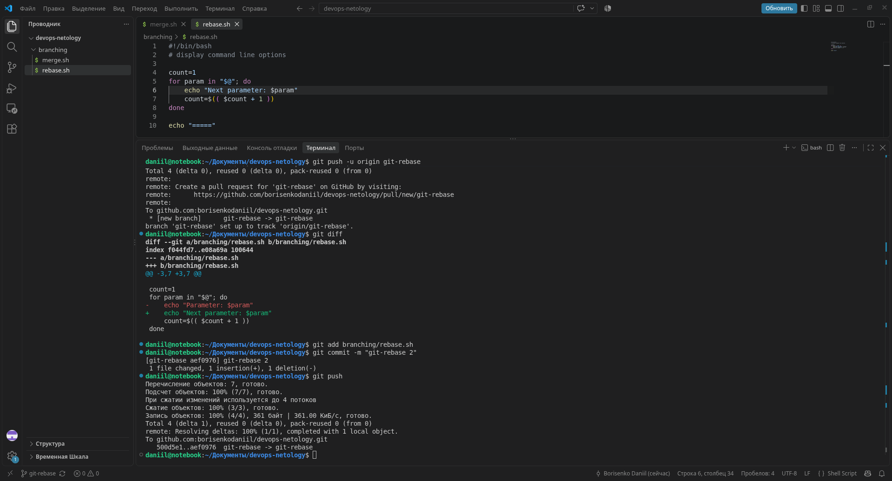

История ветки была проверена командой:

```bash
git log --oneline --decorate -4
```

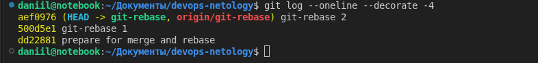

---

## 5. Network Graph

После создания веток `git-merge` и `git-rebase` был открыт раздел:

```text
Insights -> Network
```

На графе видно, что появились отдельные ветки `git-merge` и `git-rebase`.

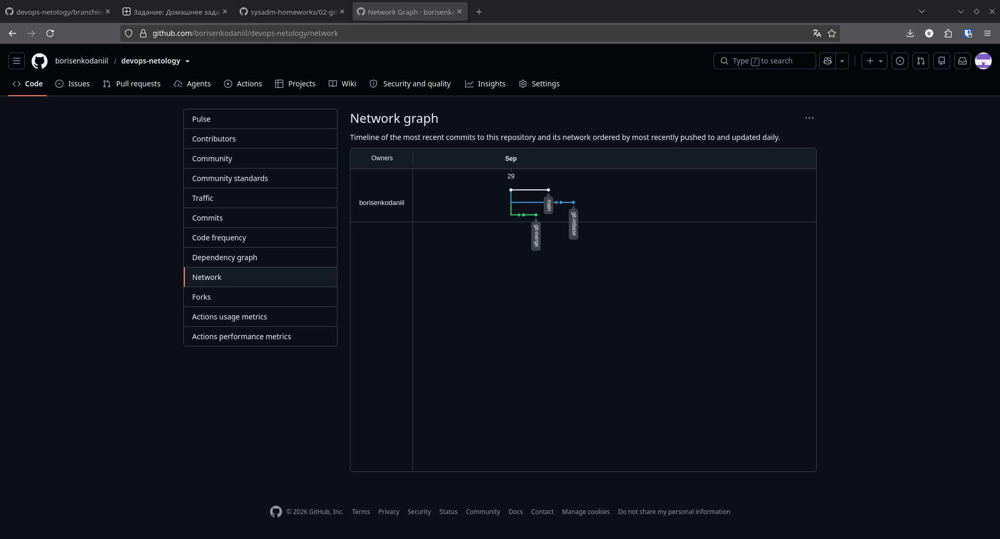

---

## 6. Merge ветки git-merge

После подготовки обеих веток был выполнен возврат в `main`:

```bash
git switch main
```

Состояние рабочей директории было проверено:

```bash
git status
```

Затем ветка `git-merge` была объединена с `main`:

```bash
git merge git-merge
```

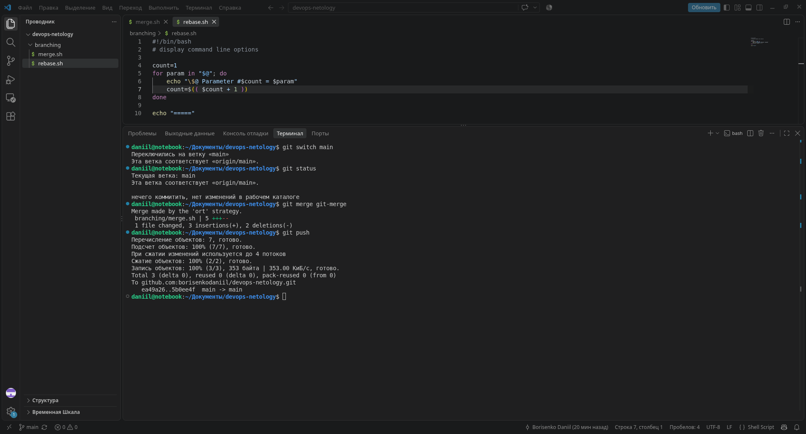

---

## 7. Rebase ветки git-rebase

После обычного merge была начата работа с веткой `git-rebase`.

Был выполнен переход в неё:

```bash
git switch git-rebase
```

Затем запущен интерактивный rebase относительно актуальной ветки `main`:

```bash
git rebase -i main
```

Во время интерактивного rebase второй коммит был объединён с первым при помощи `fixup`.

### Первый конфликт

При применении первого коммита Git обнаружил конфликт в файле:

```text
branching/rebase.sh
```

В конфликте был оставлен вариант из `main`:

```bash
echo "\$@ Parameter #$count = $param"
```

После удаления служебных меток конфликта файл был добавлен в индекс:

```bash
git add branching/rebase.sh
```

Rebase был продолжен командой:

```bash
git rebase --continue
```

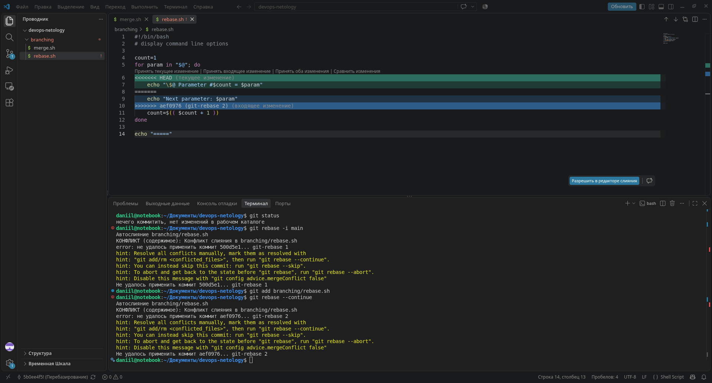

### Второй конфликт

При применении следующего изменения Git снова обнаружил конфликт в `branching/rebase.sh`.

На этот раз был оставлен вариант:

```bash
echo "Next parameter: $param"
```

После разрешения конфликта:

```bash
git add branching/rebase.sh
git rebase --continue
```


После разрешения конфликтов rebase был успешно завершён.

---

## 8. Отправка переписанной истории

После выполнения rebase попробовал отправить изменения:

```bash
git push
```

Git отклонил с ошибкой:

```text
non-fast-forward
```

Причина в том, что после rebase локальная ветка перестала совпадать с историей удалённой ветки.

Для отправки переписанной истории был выполнен принудительный push:

```bash
git push -u origin git-rebase -f
```


---

## 9. Слияние git-rebase с main

После принудительного обновления был выполнен возврат в `main`:

```bash
git switch main
```

После этого ветка `git-rebase` была объединена с `main`:

```bash
git merge git-rebase
```

Затем изменения были отправлены в удалённый репозиторий:

```bash
git push
```


---

## 10. Итоговый граф

Был повторно открыт Network Graph репозитория.

Также история была проверена командой:

```bash
git log --oneline --decorate --graph --all
```

На графе отображается итоговая история работы с ветками `main`, `git-merge` и `git-rebase`.


---
