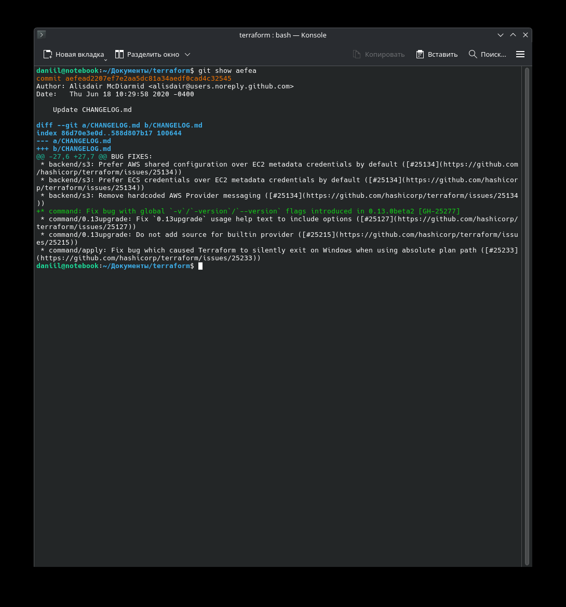
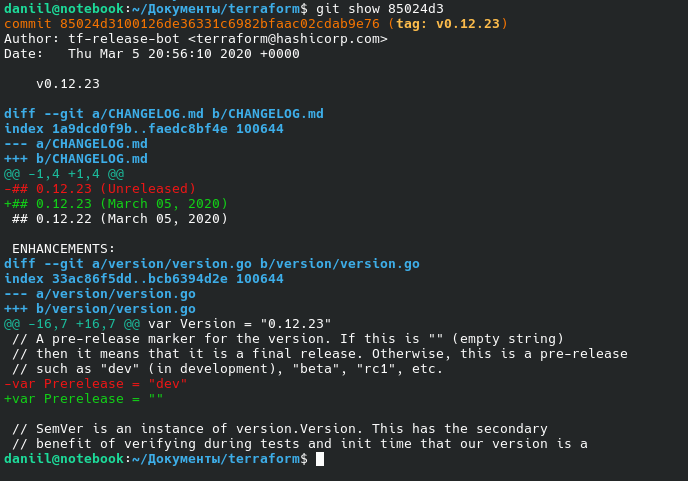
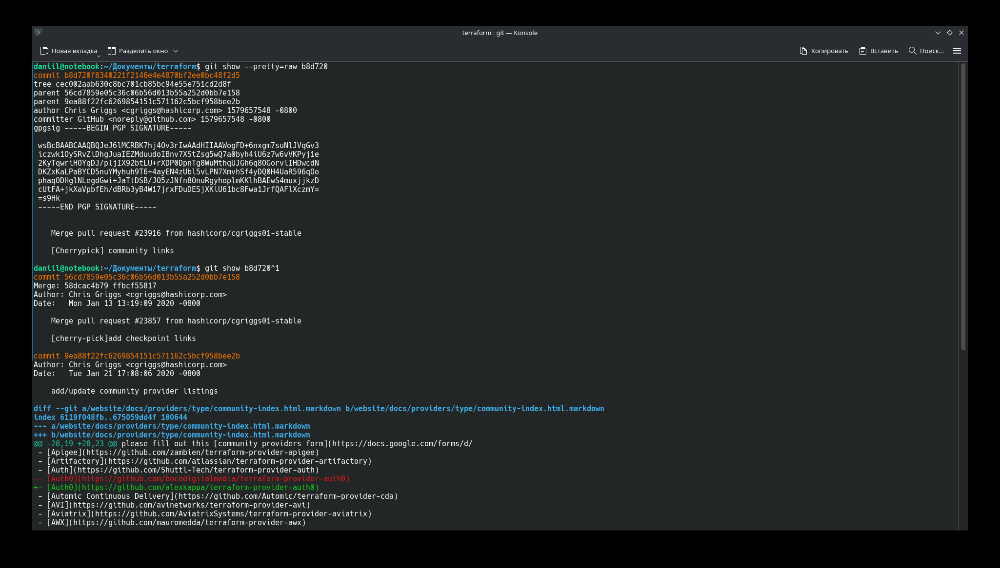
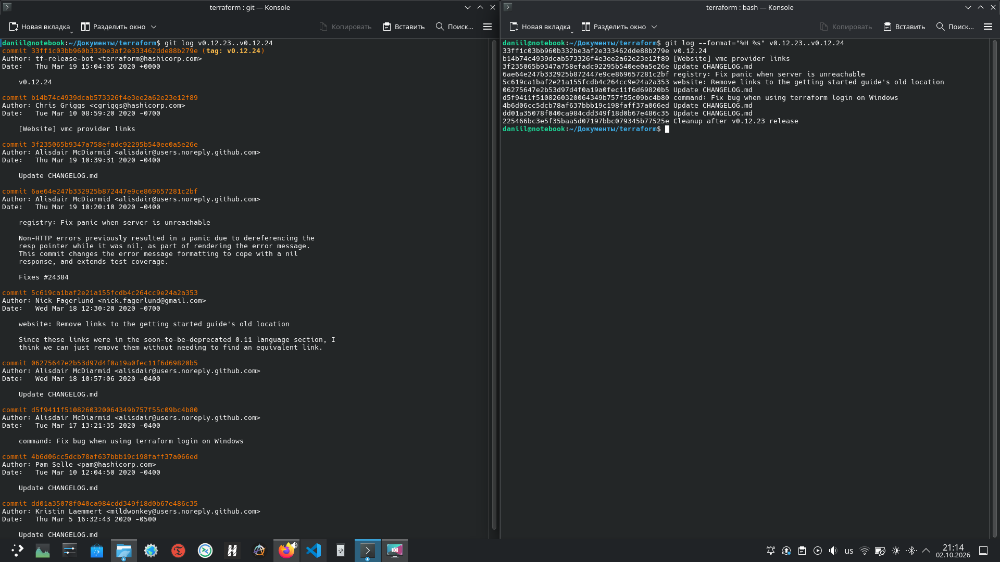
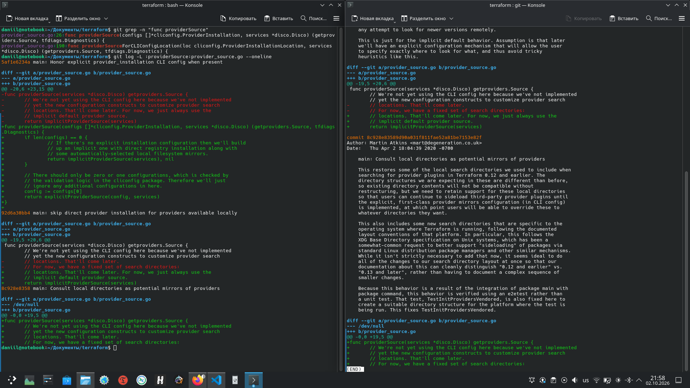
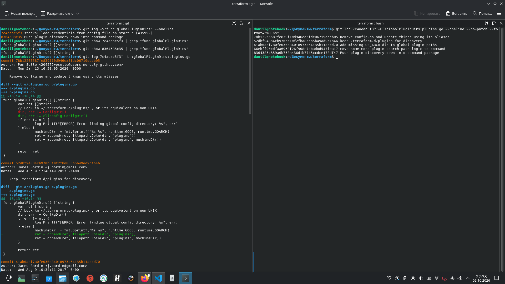
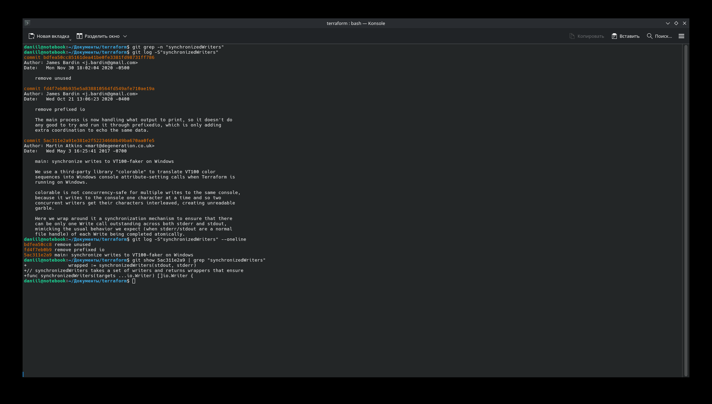

# Домашнее задание к занятию "13.04 Инструменты Git" - "Борисенко Даниил"

---

## Задание 1. Коммит `aefea`

### Условие

Найдите полный хеш и комментарий коммита, хеш которого начинается на `aefea`

### Ход решения

Для просмотра информации о коммите `aefea` использовал команду:

```bash
git show aefea
```

В результате получил полный хеш коммита:

```text
aefead2207ef7e2aa5dc81a34aedf0cad4c32545
```

Комментарий коммита:

```text
Update CHANGELOG.md
```



---

## Задание 2. Тег коммита `85024d3`

### Условие

Необходимо найти, какому тегу соответствует коммит `85024d3`.

### Ход решения

Для просмотра информации о коммите, использвал команду:

```bash
git show 85024d3
```

Полный хеш коммита:

```text
85024d3100126de36331c6982bfaac02cdab9e76
```

В выводе команды определил тег коммита:

```text
tag: v0.12.23
```



---

## Задание 3. Родители коммита `b8d720`

### Условие

Необходимо определить количество родителей у коммита `b8d720`, и указать их хеши.

### Ход решения

Для просмотра информации о коммите использовал:

```bash
git show --pretty=raw b8d720
```

В выводе присутствуют две строки `parent`, следовательно, у коммита два родителя:

```text
56cd7859e05c36c06b56d013b55a252d0bb7e158
9ea88f22fc6269854151c571162c5bcf958bee2b
```

Дополнительно проверил родителей коммита `b8d720` с помощью:

```bash
git show b8d720^1
```

Первый родитель:

```text
56cd7859e05c36c06b56d013b55a252d0bb7e158
```

Второй родитель:

```text
9ea88f22fc6269854151c571162c5bcf958bee2b
```



---

## Задание 4. Коммиты между тегами `v0.12.23` и `v0.12.24`

### Условие

Необходимо найти хеши и комментарии всех коммитов, между тегами `v0.12.23` и `v0.12.24`.

### Ход решения

Сначала просмотрел историю между двумя тегами:

```bash
git log v0.12.23..v0.12.24
```

Для получения более компактного списка использовал:

```bash
git log --format="%H %s" v0.12.23..v0.12.24
```

**где:**

- `%H` - указывает полный хеш коммита.
- `%s` - указывает комментарий.

Получил следующие коммиты:

```text
33f1fc03bb960b332be3af2e333462dde88b279e v0.12.24
b14b74c4939dcab573326f4e3ee2a62e2e31e189 [Website] vmc provider links
3f235065b9347a758efadc92295b540ee0a5e26e Update CHANGELOG.md
6ae64e247b332925b872447e9ce869657281c2bf registry: Fix panic when server is unreachable
5c619ca1baf2e21a155fcdb4c264cc9e24a2a353 website: Remove links to the getting started guide's old location
06275647e2b53d97d4f0a19a0fec11f6d69820b5 Update CHANGELOG.md
d5f9411f5108260320064349b757f55c09bc4b80 command: Fix bug when using terraform login on Windows
4b6d06cc5dcb78af637bbb19c198faff37a066ed Update CHANGELOG.md
dd01a35078f040ca984cdd349f18d0b67e486c35 Update CHANGELOG.md
225466bc3e5f35baa5d07197bbc079345b77525e Cleanup after v0.12.23 release
```



---

## Задание 5. Создание функции `providerSource`

### Условие

Необходимо найти коммит, в котором была создана функция `providerSource`.

### Ход решения

Сначала определил расположение функции:

```bash
git grep -n "func providerSource"
```

Функция находится в файле:

```text
provider_source.go
```

После этого просмотрел историю изменений функции:

```bash
git log -L :providerSource:provider_source.go --oneline
```

В истории видно, что функция была добавлена при создании файла `provider_source.go` в коммите:

```text
8c928e83589d90a031f811fae52a81be71553e82f
```



---

## Задание 6. Изменения функции `globalPluginDirs`

### Условие

Необходимо найти все коммиты, в которых изменялась функция `globalPluginDirs`.

### Ход решения

Сначала выполнил поиск по истории функции `func globalPluginDirs`:

```bash
git log -S"func globalPluginDirs" --oneline
```

В результате были найдены коммиты, связанные с появлением и удалением определения функции:

```text
7c4aeac5f3 stacks: load credentials from config file on startup (#35952)
8364383c35 Push plugin discovery down into command package
```

Проверил изменения функции в этих коммитов:

```bash
git show 7c4aeac5f3 | grep "func globalPluginDirs"
git show 8364383c35 | grep "func globalPluginDirs"
```

После этого определил файл, в котором функция находилась перед её удалением:

```bash
git grep -n "func globalPluginDirs" 7c4aeac5f3^
```

Получен файл:

```text
plugins.go
```

Для просмотра истории функции `globalPluginDirs` внутри родительского коммита `7c4aeac5f3` в файле `plugins.go` использовал:

```bash
git log 7c4aeac5f3^ -L :globalPluginDirs:plugins.go
```

В результате получил вывод всех коммитов, где встречается функция `globalPluginDirs` до фактического удаления.

Для компактного вывода списка коммитов использовал:

```bash
git log 7c4aeac5f3^ -L :globalPluginDirs:plugins.go --oneline --no-patch --format="%H %s"
```

В результате получены 5 коммитов:

```text
78b12205587fe839f10d946ea3fdc06719decb05 Remove config.go and update things using its aliases
52dbf94834cb970b510f2fba853a5b49ad9b1a46 keep .terraform.d/plugins for discovery
41ab0aef7a0fe030e84018973a64135b11abcd70 Add missing OS_ARCH dir to global plugin paths
66ebff90cdfaa6938f26f908c7ebad8d547fea17 move some more plugin search path logic to command
8364383c359a6b738a436d1b7745ccdce178df47 Push plugin discovery down into command package
```



---

## Задание 7. Автор функции `synchronizedWriters`

### Условие

Необходимо определить автора функции `synchronizedWriters`.

### Ход решения

Сначала попробовал найти функцию в текущем состоянии репозитория:

```bash
git grep -n "synchronizedWriters"
```

Функция в текущей версии репозитория не найдена, поэтому выполнил поиск по истории:

```bash
git log -S"synchronizedWriters"
```

Для компактного отображения:

```bash
git log -S"synchronizedWriters" --oneline
```

Были найдены коммиты:

```text
bdfea50cc8 remove unused
fd4f7eb0b9 remove prefixed io
5ac311e2a9 main: synchronize writes to VT100-faker on Windows
```

Самый ранний из них — коммит:

```text
5ac311e2a91e381e2f52234668b49ba670aa0fe5
```

Для проверки посмотрел изменение этого коммита:

```bash
git show 5ac311e2a9 | grep "synchronizedWriters"
```

Автор данного коммита и функции:

```text
Martin Atkins
```



---
